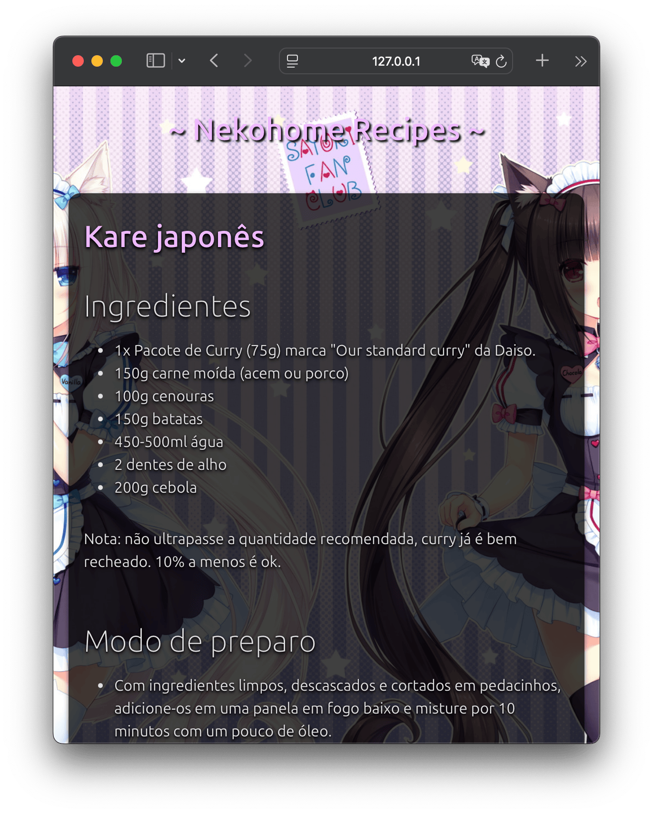

# Nekohome Recipes 📖

Receitas que aprendemos com o tempo, em um livrinho! 🇧🇷 🐱 👇
https://parklez.github.io/receitas/

## How does it work?
This is a simple webpage that renders a list of recipes (written in markdown) from a directory within this Github repository. Here's how it works in steps:

1. List files in `recipes` directory.
2. For each file in the list, fetch its content.
3. Parse the content with [marked](https://github.com/markedjs/marked) to transform the Markdown into HTML.
4. Append the HTML content to the page.

No CI/CD needed for adding new recipes, everything is freshly fetched using Github's public API as the files themselves are available in the repository itself.

## Deploying
If you plan on forking this project yourself, follow these steps:

1. Change `GITHUB_OWER` & `GITHUB_REPO` in `./docs/src/script.js` according to your username and chosen repository name.
2. Activate Github Pages at `./docs` level.

## TO-DO
- Shareable links
- Paging
- Different rendering modes
